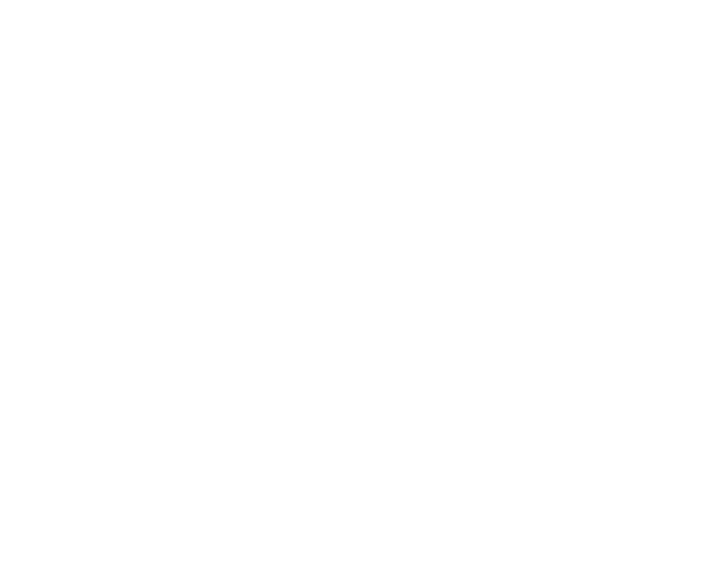

# Super Cat Fighter

  

## About This Project

Super Cat Fighter is a passion project I developed while learning JavaScript. This browser-based card battle game combines my love for retro gaming aesthetics with anime-style character design.

### Learning Journey

This project represents my journey into JavaScript development. What started as a simple learning exercise evolved into a fully-featured game with:

- Turn-based card combat system
- Character selection with unique abilities
- Animated battle sequences
- Sound effects and background music
- Responsive design

  

### Game Features

  

- **Three Unique Characters**: Choose between Miko (agile, high evasion), Jack (high attack), or Tiger (tank, high defense)

  

    
    
    
  

- **Card Combat System**: Strategic gameplay with five types of cards:

  - Attack: Deal damage to opponents
  - Defense: Block incoming attacks
  - Evasion: Chance to completely avoid damage
  - Heal: Restore health points
  - Special: Powerful 25-damage attacks

- **Character-Specific Special Abilities**: Each character has unique mechanics:

  - Miko: Charges special attack when successfully evading
  - Jack: Extra damage on successful attacks
  - Tiger: Charges special when successfully blocking

- **Complete Tutorial**: In-game instructions guide new players through the mechanics

  

### Combat System Inspiration

The game's combat mechanics draw inspiration from two nostalgic sources:

- **Pokémon Games**: The turn-based card battle system is influenced by Pokémon games from the GameBoy era
- **Childhood Playground Game**: A rhythmic clapping game I played at school where we would sing a song and, at specific points in the rhythm, perform one of three motions:
  - "Charge" (Dragon Ball Z-style ki charging motion)
  - "Block" (defensive stance)
  - "Shoot" (ki blast motion)

This playground game had a rock-paper-scissors element where timing and choice of move determined the winner - a core mechanic I wanted to capture in Super Cat Fighter's strategic card combat.

### Technologies Used

- Vanilla JavaScript (no frameworks)
- HTML5 & CSS3
- Howler.js for audio management
- Procreate on iPad for all visual assets and animations
- Working Copy mobile app for on-the-go coding

## Development Insights

Building Super Cat Fighter taught me:

- JavaScript fundamentals including objects, arrays, and DOM manipulation
- Game state management
- Animation and timing in web applications
- Audio implementation in browsers
- Responsive design principles
- Digital art creation for game assets

What makes this project unique is that I:

- **Created all visual assets** on my iPad using Procreate, including character sprites, backgrounds, and animations

  

    <h4>Miko - Stance, Attack & Defense</h4>
    
    
    
    
    <h4>Jack - Stance, Attack & Defense</h4>
    
    
    
    
    <h4>Tiger - Stance, Attack & Defense</h4>
    
    
    
  

- **Developed most of the code directly on my phone** using the Working Copy app, proving that game development doesn't always require a traditional desktop setup

## Play the Game

You can play the game directly in your browser [here](https://hyde-grey.github.io/Super-Cat-Fighter/)

## Future Improvements

As I continue to learn, I plan to enhance Super Cat Fighter with:

- More characters and card types
- Improved AI for computer opponents
- Local multiplayer functionality
- Mobile-optimized controls
- Code refactoring using modern JavaScript practices

---

_This project was created as a learning exercise and passion project. All character designs and game mechanics were created by me while learning JavaScript. All visual assets were hand-drawn on an iPad using Procreate, and most of the development was done on a mobile phone using Working Copy._
